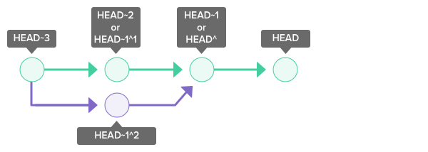

# Git

## Git Config (For Aliases)

```txt
a = add .
acm = !git add . && git commit -m
rt = restore .
f = fetch
co = checkout
cd = checkout develop
cb = checkout -b
fco = !git fetch && git checkout
br = branch
ci = commit
cm = commit -m
ca = commit --amend
cp = cherry-pick
st = status
sa = stash apply
lone = log --oneline
last = log -1 HEAD
reset = reset --hard HEAD~1
unstage = reset --soft HEAD^
current = rev-parse --abbrev-ref HEAD
plo = pull origin
pld = pull origin develop
plm = pull origin main
plc = !CURRENT=$(git current) && git pull origin $CURRENT
psc = !CURRENT=$(git current) && git push origin $CURRENT
pso = push origin
dev = !git checkout develop && git pull origin develop
main = !git checkout main && git pull origin main
brd = !sh -c 'git branch -l $1/* | xargs git branch -D' -
brdall = !sh -c 'git branch -l | xargs git branch -D' -
```

### Aliasing `git` in `.bashrc`

```sh
# Main git completions (prior to git 2.30, you an use _git instead of __git_main)
alias g="git"
__git_complete g __git_main
```

## Clone local repository

```sh
:home$ git clone git_origin this_cloned
Cloning into 'this_cloned' ...
done.

:home$ cd this_cloned
:home/this_clone$ git remote -v
origin  /home/git_origin (fetch)
origin  /home/git_origin (push)
```

To add other repository as a remote:

```sh
git remote add <remote_name> <other_repo>
```

## Get current branch

```sh
git rev-parse --abbrev-ref HEAD
```

## Get oldest commit

```sh
git rev-list --max-parents=0 HEAD
```

Rebasing using the oldest commit:

```sh
git rebase -i $(git rev-list --max-parents=0 HEAD) HEAD
```

## Get all local branches with prefix

```sh
git branch -l <prefix>/*

# Can delete found branches
git branch -l <prefix>/* | xargs git branch -D
```

## Get history of the repository

```sh
git log

# gives useful information about refs names
git log --decorate <--online>

# only short hash and commit message
git log --oneline

# with visual representation
git log --online --graph

# show all branches
git log --online --graph --all --decorate
```

Read more about git log here: <https://www.atlassian.com/git/tutorials/git-log>

## Check local changes

```sh
git diff
```

## Check URL of the cloned repository

```sh
grep -A 'remote "origin"' .git/config
```

## Recover repository state

```sh
# restore state
git reset

# default flag (staged to unstaged)
# keeps items altered in current working tree
git reset --mixed

# reset working tree to last commit
# lose changes of the items
git reset --hard
```

## Branch out from specific commit

```sh
# checkout commit to detached head
git checkout <commit hash>

# from detached head to new branch
git checkout -b <new branch_name>
```

## Stashing changes

```sh
# commit the local change to refs/stash branch
# and merge as a chield of HEAD on new refs/stash branch
git stash

# retrieve list
git stash list

# reapply changes on the same codebase
git stash pop

# get individual stash information
git stash show --patch <ID>
#git stash show --patch stash@{1}

# applying a specific stash
git stash apply <ID>
#git stash apply stash@{1}

# remove specific stash
git stash drop <ID>
#git stash drop stash@{1}
```

## Applying remote changes to local using fetch and merge

```sh
# get changes on thre remote "master" branch
git fetch origin master

# applying remote changes to local
git merge origin/master
```

You can see this repository's view of all branches by:

```sh
$ git branch --all
* master
  remotes/origin/HEAD -> origin/master
  remotes/origin/master
```

## Check tracking remote branch of local branch

```sh
$ git branch -vv
* main                          fcc92c7 [origin/main] Fix badge
  summary/Add                   6d9cefd [origin/summary/Add] Add badge
  summary/dockerfile            aa2080d Done dockerfile
  summary/internet              028b27e Fix lint
```

Note that `summary/internet` branch is not tracking any remote branch. So when pushing using `git push`, error will be encountered:

```sh
git push

fatal: The current branch summary/internet has no upstream branch.
To push the current branch and set the remote as upstream, use

    git push --set-upstream origin summary/internet
```

Solution for above error is:

```sh
# set upstream or remote branch for the local branch
git push --set-upstream origin summary/internet

# or
git push -u origin summary/internet
```

## Difference of `~`(tilde) and `^`(caret)

The `~`(tilde) and `^`(caret) symbols are used to point to a position relative to a specific commit. The symbols are used together with a commit reference, typically HEAD or a commit hash.

- `~`n refers to the nth grandparent. `HEAD~1` refers to the commit's first parent. `HEAD~2` refers to the first parent of the commit's first parent.

- `^`n refers to the the nth parent. `HEAD^1` refers to the commit's first parent. `HEAD^2` refers to the commit's second parent. A commit can have two parents in a merge commit.

<p align="center"></p>

## Add Interactive

```sh
# command for add interactive
git add -i

*** Commands ***
  1: status   2: update   3: revert   4: add untracked
  5: patch    6: diff     7: quit     8: help

# Choose patch command
What now> p
           staged     unstaged path
  1:    unchanged     +1/-1 git/README.md

Patch update>>1
           staged     unstaged path
* 1:    unchanged     +1/-1 git/README.md

Patch update>>
diff --git a/git/README.md b/git/README.md
index 930360b..7ee3668 100644
--- a/git/README.md
+++ b/git/README.md
@@ -13,4 +13,4 @@
-- [Git cherry-pick](cherry-pick.md)
+- [Git cherry-pick](cherry-pick.md) [![label: summary][~summary]][summary]
(1/1) Stage this hunk [y,n,q,a,d,/,s,e,?]?
```

Meaning of each options:

```txt
y - stage this hunk
n - do not stage this hunk
q - quit; do not stage this hunk or any of the remaining ones
a - stage this hunk and all later hunks in the file
d - do not stage this hunk or any of the later hunks in the file
g - select a hunk to go to
/ - search for a hunk matching the given regex
j - leave this hunk undecided, see next undecided hunk
J - leave this hunk undecided, see next hunk
e - manually edit the current hunk
? - print help
```

**Splitting hunks** are useful to avoid committing lines you might want to keep for local development but not persist in the repository history. A typical example of this is printed debug lines that you don’t want to get to production but want to keep for local development. Another example might be chunks of notes that only make sense to you while you are developing.

## Notes

- A `branch` is a pointer to the end of a line of changes.
- A `tag` is a pointer to a single change.
- `HEAD` is where your Git repository is right now.
- `Detached HEAD` means you are at a commit that has no reference (branch or tag) associated with it.
- `git stash apply` remains in the list but `git stash pop` will remove the stash item
- A `hunk` is a contiguous section of a `diff`.
- `reflog` is short for **ref**erence **log**. It _records all movements_ of branches in the repository.
- After rebasing using `git rebase`, you always end up in a `detached HEAD` state.
