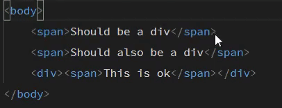
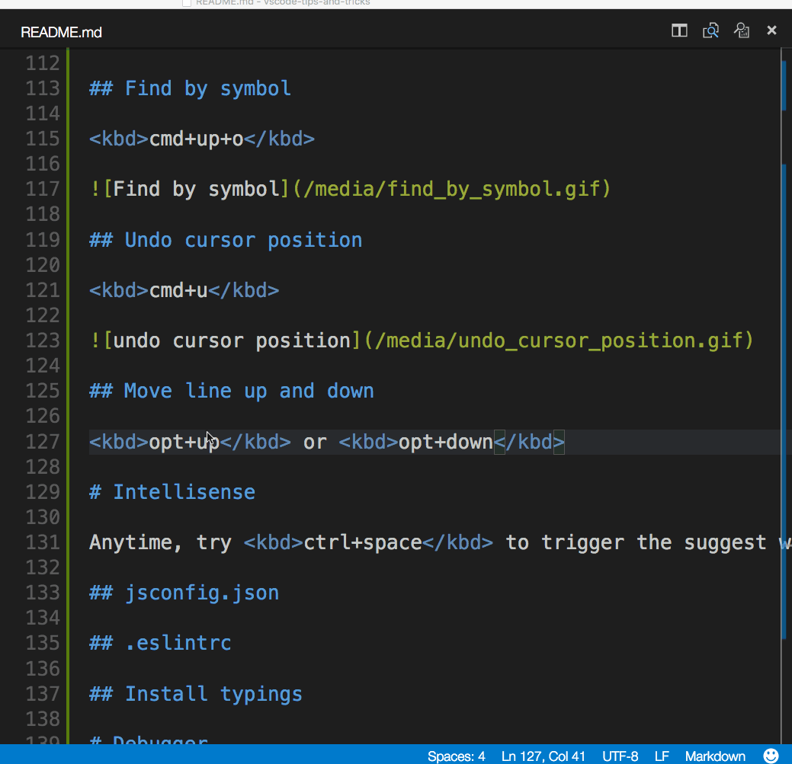

# Visual Studio Code Tips and Tricks

## Reference

<https://code.visualstudio.com/docs/getstarted/tips-and-tricks>

## Command line

```sh
# open code with current directory
code .

# open the current directory in the most recently used code window
code -r .

# create a new window
code -n

# change the language
code --locale=es

# open diff editor
code --diff <file1> <file2>

# open file at specific line and column <file:line[:character]>
code --goto package.json:10:5

# see help options
code --help

# disable all extensions
code --disable-extensions .
```

## `.vscode` folder

Workspace specific files are in a .vscode folder at the root. For example, `tasks.json` for the Task Runner and `launch.json` for the debugger.

## Change theme

Keyboard Shortcut: `Ctrl + K Ctrl + T`

<p align="center"></p>

## Customize keyboard shortcut

Keyboard Shortcut: `Ctrl + K Ctrl + S`

You can search for shortcuts and add your own keybindings to the `keybindings.json` file. Read more [here](https://code.visualstudio.com/docs/getstarted/keybindings) about Key Bindings.

<p align="center"></p>

Additionally, you can install and change your File Icon themes.

## Tune Settings

By default VS Code shows the Settings editor, you can find settings listed below in a search bar, but you can still edit the underlying `settings.json` file by using the **Open Settings (JSON)** command or by changing your default settings editor with the `workbench.settings.editor` setting.

Open User Settings `settings.json`

Keyboard Shortcut: `Ctrl + ,`

For example:

Change the font size of various UI elements

```json
// Main editor
"editor.fontSize": 18,
// Terminal panel
"terminal.integrated.fontSize": 14,
// Output panel
"[Log]": {
    "editor.fontSize": 15
}
```

Change the zoom level

```json
"window.zoomLevel": 5
````

Font ligatures

```json
"editor.fontFamily": "Fira Code",
"editor.fontLigatures": true
```

You can read more here: <https://code.visualstudio.com/docs/getstarted/tips-and-tricks#_tune-your-settings>

## Multi cursor selection

To add cursors at arbitrary positions, select a position with your mouse and use `Alt + Click`

To set cursors above or below the current position use:

Keyboard Shortcut: `Ctrl + Alt + Up` or `Ctrl + Alt + Down`

<p align="center"></p>

You can add additional cursors to all occurrences of the current selection with `Ctrl + Shift + L`.

<p align="center"></p>

> Note: You can also change the modifier to `Ctrl/Cmd` for applying multiple cursors with the `editor.multiCursorModifier` setting . See [Multi-cursor Modifier](https://code.visualstudio.com/docs/editor/codebasics#_multicursor-modifier) for details.

If you do not want to add all occurrences of the current selection, you can use `Ctrl + D` instead. This only selects the next occurrence after the one you selected so you can add selections one by one.

<p align="center"></p>

## Column (box) Selection

You can select blocks of text by holding `Shift + Alt` while you drag your mouse. A separate cursor will be added to the end of each selected line.

<p align="center"></p>

## Fast Scrolling

Pressing the `Alt` key enables fast scrolling in the editor and Explorers. By default, fast scrolling uses a 5X speed multiplier but you can control the multiplier with the **Editor: Fast Scroll Sensitivity** (`editor.fastScrollSensitivity`) setting.

## Copy line up / down

Keyboard Shortcut: `Shift + Alt + Up` or `Shift + Alt + Down`

<p align="center"></p>

## Move line up / down

Keyboard Shortcut: `Alt + Up` or `Alt + Down`

<p align="center"></p>

## Shrink / expand selection

Keyboard Shortcut: `Shift + Alt + Left` or `Shift + Alt + Right`

<p align="center"></p>
