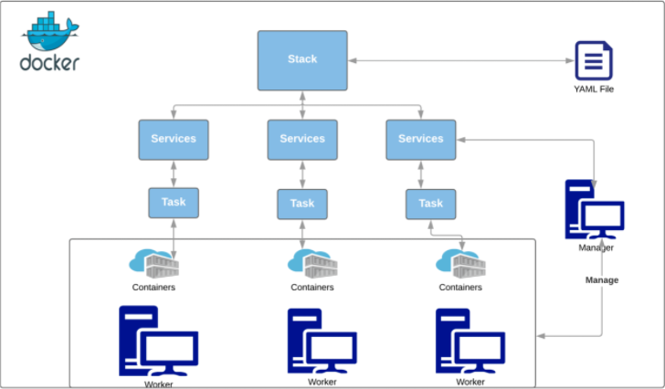
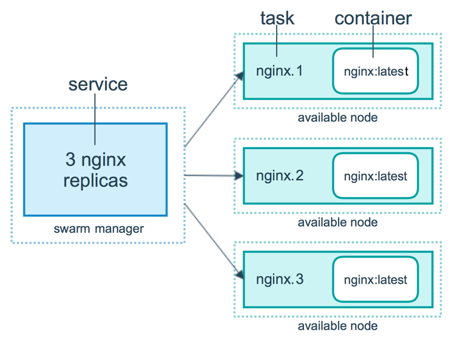

# Docker Swarm

## Container Orchestration

Suppose you have developed a wonderful application that will be used by millions of users. How will it be deployed efficiently without having a single point failure to handle a large number of requests?

Managing systems at a large scale are very difficult. Millions of containers run on different machines. How will you track which container has stopped or which service is no longer running?

Managing this cluster of containers effectively is called **container orchestration**. At present, there are three major tools available that help in container orchestration namely, **Docker swarm**, **Kubernetes**, and **Apache Mesos**.

## What is Docker Swarm

**Docker swarm** is a container orchestration tool that allows a user to manage multiple containers deployed across multiple host machines. Docker swarm has different components which help it to manage the swarm effectively.

<p align="center"></p>

A **worker node** is something on which tasks are created by the manager. It will have services running on it to maintain the state defined in the YAML file.

In this architecture, there is only one YAML file. That’s the power of the YAML file. A stack of services is created and deployed on each worker node using the YAML file.

> A node is a machine. It can act as a manager, worker, or both. We can also have multiple manager nodes but there will always be a primary node to manage the swarm cluster.

Characteristics of the manager node include:

- It always knows the exact state of the cluster
- It is responsible for maintaining the state of the cluster described in the YAML file
- It creates the different tasks on worker nodes to maintain the desired service state.
- It keeps backups in case if a node fails and, starts new containers from backups on available nodes to maintain the count of containers

## Building blocks

A swarm cluster can have the following components:

- **Node**: The node is the host machine. A machine can act as a worker, manager, or both. We can have a swarm with one node as well. In that case, the respective machine acts as both a worker and manager node.

  For example, In a cluster of 5 computers, each computer will be a node. And there will be a master computer which is responsible for the communication of the Cluster.

- **Stack**: A set of services combined is called a **stack**. Stack and Compose work somewhat similarly, except, there are some commands which will be ignored by docker-compose in a non-swarm mode such as deploy.

  For example, when we want to deploy our whole project which is a collection of services (like web server, database, and maybe a task queue) in a single command; we declare all the services in a YAML file, and that YAML file is now a stack of services for the swarm manager. The swarm manager will deploy the stack and maintain the desired states of services defined in the YAML file.

- **Service**: A service is the definition of the tasks to execute on the manager or worker nodes. It is the central structure of the swarm system and the primary root of user interaction with the swarm. When you create a service, you specify which container image to use and which commands to execute inside running containers.

  For example, The flask app created is a service. Why? Because it is using `flask_app:2.0` docker image which will be running in a container with the command to run the WSGI server.

- **Task**: Task is responsible for maintaining the desired replica set of the service. To deploy a service on a worker node, the swarm manager creates a task and starts a container in it.

  For instance, you define a service that instructs the swarm manager to keep three instances of an HTTP listener running at all times. The orchestrator responds by creating three tasks. Each task is a slot that the scheduler fills by spawning a container. The container is the instantiation of the task. If an HTTP listener task subsequently fails its health check or crashes, the orchestrator creates a new replica task that spawns a new container.

<p align="center"></p>

A **task** is a one-directional mechanism. It progresses monotonically through a series of states: assigned, prepared, running, etc. If the task fails the orchestrator removes the task and its container and then creates a new task to replace it according to the desired state specified by the service.

## Initializing the swarm node

To initialize the swarm mode, type `docker swarm init`.

```sh
$ docker swarm init
Swarm initialized: current node (ugy9at7ug87q8caa12r3nlng0) is now a manager.

To add a worker to this swarm, run the following command:

    docker swarm join --token SWMTKN-1-0jsvhtaf5lppa3zwdy4k4ik30oi06ff8jpvt0cjauvu6vnhlw5-4dl79w6tm83u5jqclmac7v743 192.168.65.3:2377

To add a manager to this swarm, run 'docker swarm join-token manager' and follow the instructions.
```

The node you started will be a manager node. We can add other machines or hosts to this swarm network using the command above with the provided token.

## Creating services

Like we have created containers using `docker run` command, a service does the same thing for a swarm cluster.

`docker service create <service name>` allows us to create a service on swarm with a defined number of containers in it.

Our aim is to create a load-balanced Flask app service and attach a database to it.

> Swarm cluster only works with prebuilt images. This means we cannot build an image using a Dockerfile while creating a container. So, we have to build the image of our app first and then create a service from it.

Now, let’s create the first service, which is our Flask login app.

### Flask App

Type `docker service create -p 5000:5000 flask_app:3.0`. This will create a service with one container in it, which is also called a **task**.

```sh
$ docker service create -p 5000:5000  flask_app:3.0
image flask_app:3.0 could not be accessed on a registry to record
its digest. Each node will access flask_app:3.0 independently,
possibly leading to different nodes running different
versions of the image.

rnlrh4e262aew2c15ldz71c5k
overall progress: 1 out of 1 tasks
1/1: running   [==================================================>]
verify: Service converged
```

If the image is not pulled from the Docker Hub, it will warn us saying other swarm nodes may not have the same image, which is fine for now.

At this point, if you open `localhost:5000` to see the app, you will get `MySQLdb._exceptions.OperationalError MySQLdb._exceptions.OperationalError: (2005, "Unknown MySQL server host 'database' (-2)")` error because we don’t have a database running yet.

So, the next task is to create a database service.

### Database Services

Let’s create a service by using a mysql-server image locally. Type `docker service create --name database --env-file <.env file location> --mount type=bind,src=<location of init.sql>,dst=/docker-entrypoint-initdb.d/init.sql mysql/mysql-server:5.7`

```sh
$ docker service create --name database --env-file .env --mount type=bind,src=/Users/venkateshachint
alwar/Documents/Online_Projects/Docker/db/init.sql,dst=/docker-entrypoint-initdb.d/init.sql mysql/mysql-server:5.7
is4ct57yaqu0mimuywhy05asp
overall progress: 1 out of 1 tasks
1/1: running   [==================================================>]
verify: Service converged
```

The command is a little bit longer. Let’s understand each argument of the command.

- `--name`: name of the service through which it can be reachable
- `--mount`: bind local file system to the container file system
- `--env_file`: to provide environment variables using the file

Type `docker service ls` to list all the services available on the swarm node.

### Networking

Both services are running now, but, you will get the same error as they are not connected. If you remember, the `link` argument used in `docker-compose.yml` is used to connect the database container. In swarm mode, the `link` option is not supported and we have to connect services using a network.

Services connected to the same network can talk to each other. So, to connect our database service to app service, we will create an “overlay network”. In swarm mode, we deal with distributed systems, hence, we use an overlay network to establish communication between services.

To create an overlay network, type `docker network create --driver=overlay app`. This will create a new network named ‘app’ on Docker host.

```sh
$ docker network create --driver=overlay app
riv3bf55f1xkemfjmm9w2tb5i

$ docker network ls
NETWORK ID          NAME                DRIVER              SCOPE
riv3bf55f1xk        app                 overlay             swarm
```

### Updating Services

Now, we have our overlay network. Let’s attach it to both the services and let’s see if it solves the problem or not.

To update a service, type `docker service update --network-add <network name> <service name/ID>`.

```sh
$ docker service update --network-add app rnlrh4e262ae
rnlrh4e262ae
overall progress: 1 out of 1 tasks
1/1: running   [==================================================>]
verify: Service converged

$ docker service update --network-add app database
database
overall progress: 1 out of 1 tasks
1/1: running   [==================================================>]
verify: Service converged
```

As soon as the network is updated, you will see that your app start working normally. We have deployed our app using services on the swarm node. Check out all the containers using `docker ps`. Docker service offers a few more commands to help you work with services.

## Scaling app containers

You can deploy multiple containers on a different node. If there are multiple nodes in the cluster, the swarm manager will create container copy on every other node until it covers all the nodes or the defined number of containers are created. And if there is only a single node in the cluster, all the containers are created in only that node.

We will scale our app to have three app containers and two database containers. Type `docker service scale <service ID/Name>=Replicas_number`.

```sh
$ docker service scale rnlrh4e262ae=3
rnlrh4e262ae scaled to 3
overall progress: 3 out of 3 tasks
1/3: running   [==================================================>]
2/3: running   [==================================================>]
3/3: running   [==================================================>]verify: Service converged

$ docker service scale database=2
database scaled to 2
overall progress: 2 out of 2 tasks1/2: running   [==================================================>]
2/2: running   [==================================================>]verify: Service converged
```

Great, you have scaled your app to handle the extra load. The swarm manager will take care of load balancing. To check whether the service is scaled or not, type `docker service ls` and check the replica column.

```sh
$ docker service ls
ID                  NAME                MODE                REPLICAS            IMAGE                    PORTS
is4ct57yaqu0        database            replicated          2/2                 mysql/mysql-server:5.7
rnlrh4e262ae        priceless_napier    replicated          3/3                 flask_app:3.0            *:5000->5000/tcp
```

Type `docker ps` to see all the running containers.

Services can be scaled up and down using the same command. If you just provide the number of replicas, the swarm manager will create or stop the containers based on the number provided.

## Monitoring Clusters using a Visuaizer

Now, we are going to see our swarm cluster. The image we are going to use for our cluster visualization is [dockersamples/docker-swarm-visualizer](https://github.com/dockersamples/docker-swarm-visualizer).

### Running as a container

Type `$ docker run -it -d -p 8080:8080 -v /var/run/docker.sock:/var/run/docker.sock dockersamples/visualizer`

This will run the container with host port `8080` mapped to the container port `8080`.

### Running as a service

To run a visualizer as a service on swarm node, type, `docker service create --name=viz --publish=8080:8080/tcp --constraint=node.role==manager --mount=type=bind,src=/var/run/docker.sock,dst=/var/run/docker.sock dockersamples/visualizer`

Parameters:

- `--publish`: mapping of host and container ports
- `--constraint`: location or name of the node on which the service will be created
- `--mount`: bind Docker socket to container socket to receive all the events from Docker host

This will create the service on the swarm manager node as mentioned in the constraint parameter.Open up a browser and go to `localhost:8080`.

## Docker Stack Implementation

With [docker-compose.yml](resources/docker-swarm-images/docker-compose.yml), deploy the services on the swarm manager node below:

```sh
$ docker stack deploy login_app --compose-file=docker-compose.yml
Creating network login_app_app
Creating service login_app_web
Creating service login_app_database
Creating service login_app_viz
```

This will deploy a stack of all services on swarm manager with just one command.

Now, verify the services using `docker service ls`.

```sh
$ docker service ls
ID                  NAME                 MODE                REPLICAS            IMAGE                             PORTS
iv1nkq62i6fx        login_app_database   replicated          2/2                 mysql/mysql-server:5.7
yo7o89dr5s9b        login_app_viz        replicated          1/1                 dockersamples/visualizer:latest   *:8080->8080/tcp
rpuagx2yj9zg        login_app_web        replicated          3/3                 venky8283/flask_app:3.0           *:5000->5000/tcp
```

### Docker stack commands

```sh
docker stack [OPTIONS] COMMAND
```

- `deploy`: We used this one to deploy our stack. We can update the docker-compose file and redeploy stack
- `ls`: This provides a short overview of stack
- `ps`: Lists down all the containers created by the stack
- `services`: Lists all the services in the stack
- `rm`: Removes stack from the swarm nodes, including network
