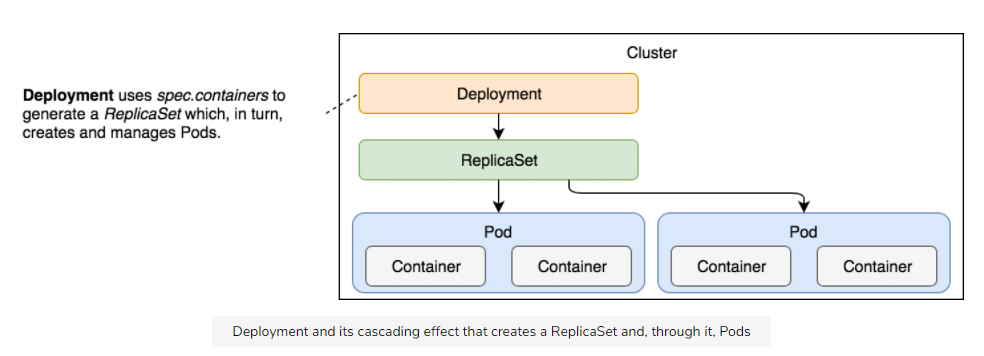
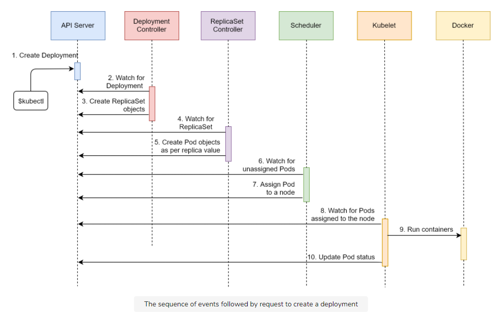

# Deployments

Resources for this page can be found here: [resources/k8s-specs/pod](resources/k8s-specs/deploy).

## Deploying Releases

In today’s competitive environment, we have to release features to production as soon as they are developed and tested. The need for frequent releases fortifies the need for zero-downtime deployments.

We learned how to deploy our applications packaged as Pods, how to scale them through ReplicaSets, and how to enable communication through Services. However, all that is useless if we cannot update those applications with new releases. That is where Kubernetes Deployments come in handy.

The desired state of our applications is changing all the time. The most common reasons for new states are new releases. The process is relatively simple. We make a change and commit it to a code repository. We build it, and we test it. Once we’re confident that it works as expected, we deploy it to a cluster.

It does not matter whether that deployment is to a development, test, staging, or production environment. We need to deploy a new release to a cluster, even when that is a single-node Kubernetes running on a laptop. No matter how many environments we have, the process should always be the same or, at least, as similar as possible.

## Zero Downtime

The deployment must produce no downtime. It does not matter whether it is performed on a testing or a production cluster. Interrupting consumers is disruptive, and that leads to loss of money and confidence in a product.

While we might never be able to reach 100% availability, we should certainly not cause downtime ourselves and must minimize other factors that could cause downtime.

## Creating Deployment

Look at [deploy/go-demo-2-db.yml](resources/k8s-specs/deploy/go-demo-2-db.yml):

```sh
# Checking deployment yml file
$ cat deploy/go-demo-2-db.yml

apiVersion: apps/v1
kind: Deployment
metadata:
  name: go-demo-2-db
spec:
  selector:
    matchLabels:
      type: db
      service: go-demo-2
  template:
    metadata:
      labels:
        type: db
        service: go-demo-2
        vendor: MongoLabs
    spec:
      containers:
      - name: db
        image: mongo:3.3
        ports:
        - containerPort: 28017

# Creating the deployment
$ kubectl create -f deploy/go-demo-2-db.yml --record
$ kubectl get -f deploy/go-demo-2-db.yml

NAME           READY   UP-TO-DATE   AVAILABLE   AGE
go-demo-2-db   0/1     1            0           4s

# Describing the deployment
$ kubectl describe -f deploy/go-demo-2-db.yml

...
Events:
  Type   Reason            Age  From                  Message
  ----   ------            ---- ----                  -------
  Normal ScalingReplicaSet 2m   deployment-controller Scaled up replica set go-demo-2-db-75fbcbb5cd to 1
```

From the Events section, we can observe that the Deployment created a ReplicaSet or to be more precise, that it scaled it. It shows that Deployments control ReplicaSets. The Deployment created the ReplicaSet which, in turn, created Pods.

```sh
$ kubectl get all

NAME                                READY   STATUS    RESTARTS   AGE
pod/go-demo-2-db-694bfb44cb-n6rxl   1/1     Running   0          7m49s

NAME                 TYPE        CLUSTER-IP   EXTERNAL-IP   PORT(S)   AGE
service/kubernetes   ClusterIP   10.96.0.1    <none>        443/TCP   9m40s

NAME                           READY   UP-TO-DATE   AVAILABLE   AGE
deployment.apps/go-demo-2-db   1/1     1            1           7m49s

NAME                                      DESIRED   CURRENT   READY   AGE
replicaset.apps/go-demo-2-db-694bfb44cb   1         1         1       7m49s
```

<p align="center"></p>

### The Sequence

1. Kubernetes client (`kubectl`) sent a request to the API server requesting the creation of a Deployment defined in the `deploy/go-demo-2-db.yml` file.
2. The deployment controller is watching the API server for new events, and it detected that there is a new Deployment object.
3. The deployment controller creates a new ReplicaSet object.
4. Events that happened after the ReplicaSet object was created which is already explained [here](replicasets.md#sequential-breakdown-of-the-process).

<p align="center"></p>

## Updating Deployments

Let’s see what happens when we `set` a new image to the `db` Pod:

```sh
$ kubectl set image -f deploy/go-demo-2-db.yml db=mongo:3.4 --record
$ kubectl describe -f deploy/go-demo-2-db.yml

...
Events:
  Type    Reason             Age   From                   Message
  ----    ------             ----  ----                   -------
  Normal  ScalingReplicaSet  19m   deployment-controller  Scaled up replica set go-demo-2-db-75fbcbb5cd to 1
  Normal  ScalingReplicaSet  5m    deployment-controller  Scaled up replica set go-demo-2-db-f8d4b86ff to 1
  Normal  ScalingReplicaSet  0s    deployment-controller  Scaled down replica set go-demo-2-db-75fbcbb5cd to 0
```

We can see that it created a new ReplicaSet and that it scaled the old ReplicaSet to `0`. If, in your case, the last line did not appear, you’ll need to wait until the new version of the `mongo` image is pulled.

Instead of operating directly on the level of Pods, the Deployment created a new ReplicaSet which, in turn, produced Pods based on the new image. Once they became fully operational, it scaled the old ReplicaSet to `0`.

```sh
$ kubectl get all

NAME                                READY   STATUS              RESTARTS   AGE
pod/go-demo-2-db-694bfb44cb-n6rxl   1/1     Running             0          17m
pod/go-demo-2-db-6b97cd9dfc-kbzp4   0/1     ContainerCreating   0          47s

NAME                 TYPE        CLUSTER-IP   EXTERNAL-IP   PORT(S)   AGE
service/kubernetes   ClusterIP   10.96.0.1    <none>        443/TCP   19m

NAME                           READY   UP-TO-DATE   AVAILABLE   AGE
deployment.apps/go-demo-2-db   1/1     1            1           17m

NAME                                      DESIRED   CURRENT   READY   AGE
replicaset.apps/go-demo-2-db-694bfb44cb   1         1         1       17m
replicaset.apps/go-demo-2-db-6b97cd9dfc   1         1         0       48s
```

As you can see, both ReplicaSets are there. However, one is inactive (scaled to `0`).

You’ll notice that contained within the name of the Pod is a hash which matches the hash in the name of the new ReplicaSet, namely f8d4b86ff. Even though it might look like it is a random value, it is not.

If you destroy the Deployment and create it again, you’ll notice that the hash in the Pod name and ReplicaSet name remain consistent. This value is generated by hashing the PodTemplate of the ReplicaSet. As long as the PodTemplate is the same, the hash value will be the same as well. That way a Deployment can know whether anything related to the Pods has changed and, if it does, will create a new ReplicaSet.

## Deployment Strategies

Let’s look into a bit of detail of both `Recreate` and `RollingUpdate` strategies.

### Recreate Strategy

The `Recreate` strategy is much better suited for a single-replica image. If we’re running the database as a single replica, we must have mounted a network drive volume. That would allow us to avoid data loss when updating it or in case of a failure. Since most databases (MongoDB included) cannot have multiple instances writing to the same data files, killing the old release before creating a new one is a good strategy when replication is absent.

### RollingUpdate Strategy

The `RollingUpdate` strategy is the default type, for a good reason. It allows us to deploy new releases without downtime. It creates a new ReplicaSet with zero replicas and, depending on other parameters, increases the replicas of the new one, and decreases those from the old one. The process is finished when the replicas of the new ReplicaSet entirely replace those from the old one.

When `RollingUpdate` is the strategy of choice, it can be fine-tuned with the `maxSurge` and `maxUnavailable` fields. The former defines the maximum number of Pods that can exceed the desired number (set using `replicas`). It can be set to an absolute number (e.g., `2`) or a percentage (e.g., `35%`). The total number of Pods will never exceed the desired number (set using `replicas`) and the `maxSurge` combined. The default value is `25%`.

`maxUnavailable` defines the maximum number of Pods that are not operational. If, for example, the number of replicas is set to `15` and this field is set to `4`, the minimum number of Pods that would run at any given moment would be `11`. Just as the `maxSurge` field, this one also defaults to `25%`. If this field is not specified, there will always be at least `75%` of the desired Pods.

In most cases, the default values of the Deployment specific fields are a good option.
