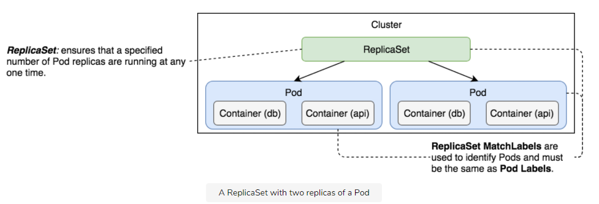
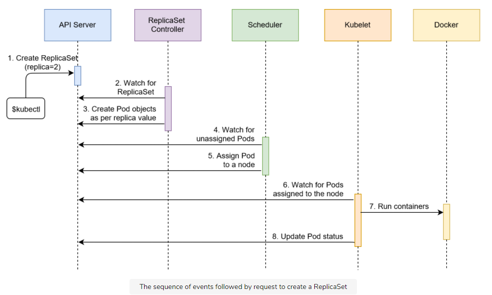
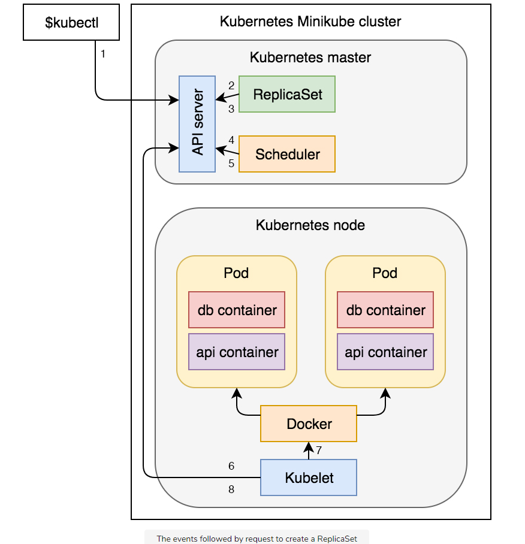
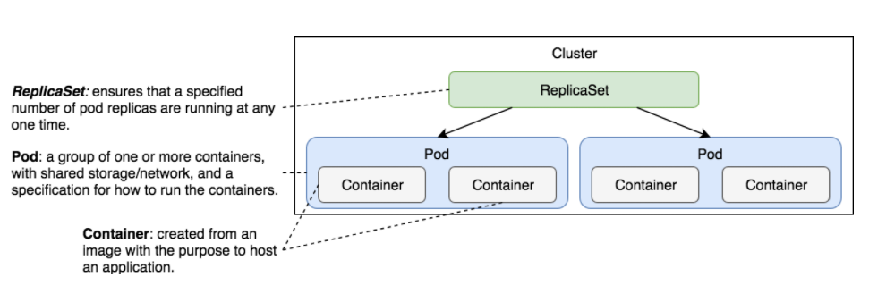

# ReplicaSets

Resources for this page can be found here: [resources/k8s-specs/rs](resources/k8s-specs/rs)

A ReplicaSet's purpose is to maintain a stable set of replica Pods running at any given time. As such, it is often used to guarantee the availability of a specified number of identical Pods.

## Creating the ReplicaSet

```sh
$ kubectl create -f rs/go-demo-2.yml
$ kubectl get rs

NAME      DESIRED CURRENT READY AGE
go-demo-2 2       2       0     14s

$ kubectl describe -f rs/go-demo-2.yml

...
Events:
  Type   Reason           Age  From                  Message
  ----   ------           ---- ----                  -------
  Normal SuccessfulCreate 3m   replicaset-controller Created pod: go-demo-2-v59t5
  Normal SuccessfulCreate 3m   replicaset-controller Created pod: go-demo-2-5fd54

$ kubectl get pods --show-labels

NAME            READY STATUS  RESTARTS AGE LABELS
go-demo-2-5fd54 2/2   Running 0        6m  db=mongo,language=go,service=go-demo-2,type=backend
go-demo-2-v59t5 2/2   Running 0        6m  db=mongo,language=go,service=go-demo-2,type=backend
```

<p align="center"></p>

## Sequential Breakdown of the Process

The sequence of events that transpired with the kubectl create -f rs/go-demo-2.yml command is as follows.

1. Kubernetes client (`kubectl`) sent a request to the API server requesting the creation of a ReplicaSet defined in the [`rs/go-demo-2.yml`](resources/k8s-specs/rs/go-demo-2.yml) file.
2. The controller is watching the API server for new events, and it detected that there is a new ReplicaSet object.
3. The controller creates two new pod definitions because we have configured replica value as `2` in `rs/go-demo-2.yml` file.
4. Since the scheduler is watching the API server for new events, it detected that there are two unassigned Pods.
5. The scheduler decided which node to assign the Pod and sent that information to the API server.
6. Kubelet is also watching the API server. It detected that the two Pods were assigned to the node it is running on.
7. Kubelet sent requests to Docker requesting the creation of the containers that form the Pod. In our case, the Pod defines two containers based on the `mongo` and `api` image. So in total four containers are created.
8. Finally, Kubelet sent a request to the API server notifying it that the Pods were created successfully.

<p align="center"></p>

The sequence we described is useful when we want to understand everything that happened in the cluster from the moment we requested the creation of a new ReplicaSet. However, it might be too confusing so we’ll try to explain the same process through a diagram that more closely represents the cluster.

<p align="center"></p>

> Note that the diagram above uses `Minikube` to create Kubernetes cluster that is why there’s only one server that acts as both the master and the node. Typically, we’d have a multi-node cluster, and the Pods would be distributed across it.

## Summary

The good news is that ReplicaSets are relatively straightforward. They provide a guarantee that the specified number of replicas of a Pod will be running in the system as long as there are available resources. That’s the primary and, arguably, the only purpose.

The bad news is that ReplicaSets are rarely used independently. You will almost never create a ReplicaSet directly just as you’re not going to create Pods. Instead, we tend to create ReplicaSets through Deployments. In other words, we use ReplicaSets to create and control Pods, and Deployments to create ReplicaSets (and a few other things).

If you’d like to know more about ReplicaSets, please explore [ReplicaSet v1 apps API](https://v1-18.docs.kubernetes.io/docs/reference/generated/kubernetes-api/v1.18/#replicaset-v1-apps) documentation.

<p align="center"></p>
