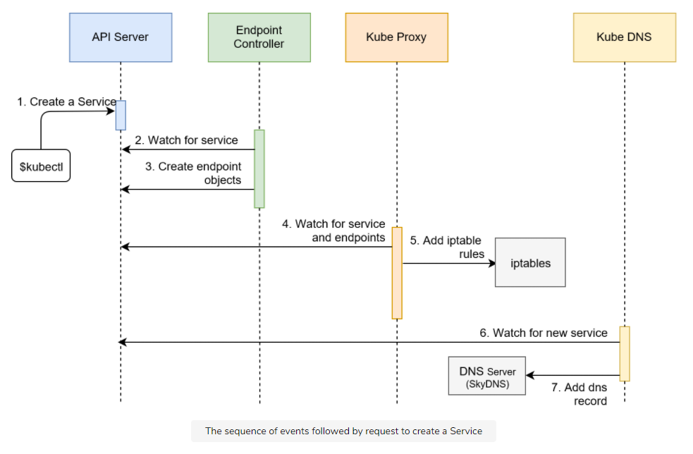

# Services

Resources for this page can be found here: [resources/k8s-specs/svc](resources/k8s-specs/svc)

## Problem: Communication between Pods

Pods are the smallest unit in Kubernetes and have a relatively short life-span. They are born, and they are destroyed. They are never healed. The system heals itself by creating new Pods (cells) and by terminating those that are unhealthy or those that are surplus. The system is long-living, Pods are not.

Controllers, together with other components like the scheduler, are making sure that the Pods are doing the right thing. They control the scheduler. We used only one of them so far.

ReplicaSet is in charge of making sure that the desired number of Pods is always running. If there’s too few of them, new ones will be created. If there’s too many of them, some will be destroyed. Pods that become unhealthy are terminated as well. All that, and a bit more, is controlled by ReplicaSet.

The problem with this setup is that there are no communication paths. The Pods cannot speak with each other. So far, only containers inside a Pod can talk with each other through localhost. That led us to the design where both the API and the database needed to be inside the same Pod. That was a lousy solution for quite a few reasons.

The main problem is that we cannot scale one without the other. We could not design the setup in a way that there are, for example, three replicas of the API and one replica of the database. The primary obstacle was communication.

Truth be told, each Pod does get its own address. We could have split the API and the database into different Pods and configure the API Pods to communicate with the database through the address of the Pod it lives in.

However, since Pods are unreliable, short-lived, and volatile, we cannot assume that the database would always be accessible through the IP of a Pod. When that Pod gets destroyed (or fails), the ReplicaSet would create a new one and assign it a new address.

**Kubernetes Services** provide addresses through which associated Pods can be accessed.

## Creating the ReplicaSet

Look at [svc/go-demo-2-rs.yml](resources/k8s-specs/svc/go-demo-2-rs.yml)

```sh
$ cat svc/go-demo-2-rs.yml

...
- name: db
  image: mongo:3.3
  command: ["mongod"]
  args: ["--rest", "--httpinterface"]
  ports:
  - containerPort: 28017
    protocol: TCP
...
```

We customized the command and the arguments so that MongoDB exposes the REST interface. We also defined the `containerPort`. Those additions are needed so that we can test that the database is accessible through the Service.

```sh
$ kubectl create -f svc/go-demo-2-rs.yml
$ kubectl get -f svc/go-demo-2-rs.yml

NAME      DESIRED CURRENT READY AGE
go-demo-2 2       2       2     1m
```

### Exposing a Resource

We can use the kubectl expose command to expose a resource as a new Kubernetes Service. That resource can be a Deployment, another Service, a ReplicaSet, a ReplicationController, or a Pod. We’ll expose the ReplicaSet since it is already running in the cluster.

```sh
kubectl expose rs go-demo-2 \
    --name=go-demo-2-svc \
    --target-port=28017 \
    --type=NodePort
```

As a result, the target port will be exposed on every node of the cluster to the outside world, and it will be routed to one of the Pods controlled by the ReplicaSet.

## The Sequence

The processes that were initiated with the creation of the Service are as follows:

1. Kubernetes client (`kubectl`) sent a request to the API server requesting the creation of the Service based on Pods created through the go-demo-2 ReplicaSet.
2. Endpoint controller is watching the API server for new service events. It detected that there is a new Service object.
3. Endpoint controller created endpoint objects with the same name as the Service, and it used Service selector to identify endpoints (in this case the IP and the port of go-demo-2 Pods).
4. kube-proxy is watching for service and endpoint objects. It detected that there is a new Service and a new endpoint object.
5. kube-proxy added iptables rules which capture traffic to the Service port and redirect it to endpoints. For each endpoint object, it adds iptables rule which selects a Pod.
6. The kube-dns add-on is watching for Service. It detected that there is a new service.
7. The kube-dns added `db`'s record to the dns server (`skydns`).

<p align="center"></p>

The sequence we described is useful when we want to understand everything that happened in the cluster from the moment we requested the creation of a new Service. However, it might be too confusing so we’ll try to explain the same process through a diagram that more closely represents the cluster.

<p align="center"></p>

```sh
$ kubectl describe svc go-demo-2-svc

Name:                    go-demo-2-svc
Namespace:               default
Labels:                  db=mongo
                         language=go
                         service=go-demo-2
                         type=backend
Annotations:             <none>
Selector:                service=go-demo-2,type=backend
Type:                    NodePort
IP:                      10.0.0.194
Port:                    <unset>  28017/TCP
TargetPort:              28017/TCP
NodePort:                 <unset>  31879/TCP
Endpoints:               172.17.0.4:28017,172.17.0.5:28017
Session Affinity:        None
External Traffic Policy: Cluster
Events:                  <none>
```

<p align="center"></p>

## Creating the Service

Look at [svc/go-demo-2-svc.yml](resources/k8s-specs/svc/go-demo-2-svc.yml)

```sh
$ cat svc/go-demo-2-rs.yml

apiVersion: v1
kind: Service
metadata:
  name: go-demo-2
spec:
  type: NodePort
  ports:
  - port: 28017
    nodePort: 30001
    protocol: TCP
  selector:
    type: backend
    service: go-demo-2
```

```sh
$ kubectl create -f svc/go-demo-2-svc.yml
$ kubectl get -f svc/go-demo-2-svc.yml

NAME      TYPE     CLUSTER-IP EXTERNAL-IP PORT(S)         AGE
go-demo-2 NodePort 10.0.0.129 <none>      28017:30001/TCP 10m
```

<p align="center"></p>

## Discovering Services

Services can be discovered through two principal modes:

- Environment variables
- DNS

Every Pod gets environment variables for each of the active Services. They are provided in the same format as what Docker links expect, as well with the simpler Kubernetes-specific syntax.

Let’s take a look at the environment variables available in one of the Pods we’re running.

```sh
$ POD_NAME=$(kubectl get pod \
    --no-headers \
    -o=custom-columns=NAME:.metadata.name \
    -l type=api,service=go-demo-2 \
    | tail -1)
$ kubectl exec $POD_NAME env

GO_DEMO_2_DB_PORT=tcp://10.0.0.250:27017
GO_DEMO_2_DB_PORT_27017_TCP_ADDR=10.0.0.250
GO_DEMO_2_DB_PORT_27017_TCP_PROTO=tcp
GO_DEMO_2_DB_PORT_27017_TCP_PORT=27017
GO_DEMO_2_DB_PORT_27017_TCP=tcp://10.0.0.250:27017
GO_DEMO_2_DB_SERVICE_HOST=10.0.0.250
GO_DEMO_2_DB_SERVICE_PORT=27017
```

The first five variables are using the Docker format. If you already worked with Docker networking, you should be familiar with them. At least, if you’re familiar with the way Swarm (standalone) and Docker Compose operate. Later version of Swarm (Mode) still generate the environment variables but they are mostly abandoned by the users in favour of DNSes.

The last two environment variables are Kubernetes specific and follow the `[SERVICE_NAME]_SERVICE_HOST` and `[SERVICE_NAME]_SERIVCE_PORT` format (service name is upper-cased).

```sh
$ kubectl describe svc go-demo-2-db

Name:              go-demo-2-db
Namespace:         default
Labels:            <none>
Annotations:       <none>
Selector:          service=go-demo-2,type=db
Type:              ClusterIP
IP:                10.0.0.250
Port:              <unset>  27017/TCP
TargetPort:        27017/TCP
Endpoints:         172.17.0.4:27017
Session Affinity:  None
Events:            <none>
```

The key is in the IP field. That is the IP through which this service can be accessed and it matches the values of the environment variables `GO_DEMO_2_DB_*` and `GO_DEMO_2_DB_SERVICE_HOST`.

The code inside the containers that form the `go-demo-2-api` Pods could use any of those environment variables to construct a connection string towards the `go-demo-2-db` Pods. For example, we could have used `GO_DEMO_2_DB_SERVICE_HOST` to connect to the database. And, yet, we didn’t do that. The reason is simple. It is easier to use DNS instead.

### Sequential Breakdown of the Process

Let’s go through the sequence of events related to service discovery and components involved.

1. When the `api` container `go-demo-2` tries to connect with the `go-demo-2-db` Service, it looks at the nameserver configured in `/etc/resolv.conf`. kubelet configured the nameserver with the kube-dns Service IP (`10.96.0.10`) during the Pod scheduling process.
2. The container queries the DNS server listening to port `53`. `go-demo-2-db` DNS gets resolved to the service IP `10.0.0.19`. This DNS record was added by kube-dns during the service creation process.
3. The container uses the service IP which forwards requests through the iptables rules. They were added by kube-proxy during Service and Endpoint creation process.
4. Since we only have one replica of the `go-demo-2-db` Pod, iptables forwards requests to just one endpoint. If we had multiple replicas, iptables would act as a load balancer and forward requests randomly among Endpoints of the Service.

<p align="center"></p>

## Summary

Services are indispensable objects without which communication between Pods would be hard and volatile. They provide static addresses through which we can access them not only from other Pods but also from outside the cluster. This ability to have fixed entry points is crucial as it provides stability to otherwise dynamic elements of the cluster. Pods come and go, Services stay.

If you’d like to know more about Services, please explore [Service v1 core API](https://v1-18.docs.kubernetes.io/docs/reference/generated/kubernetes-api/v1.18/#service-v1-core) documentation.

<p align="center"></p>
