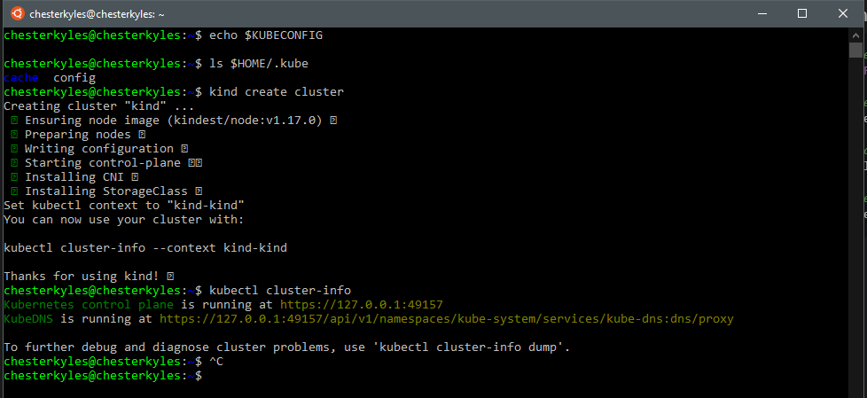
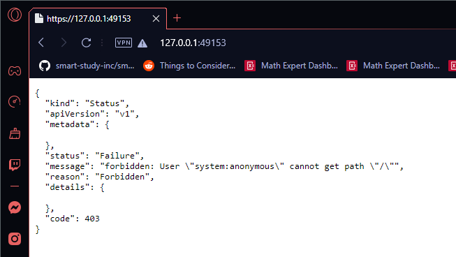
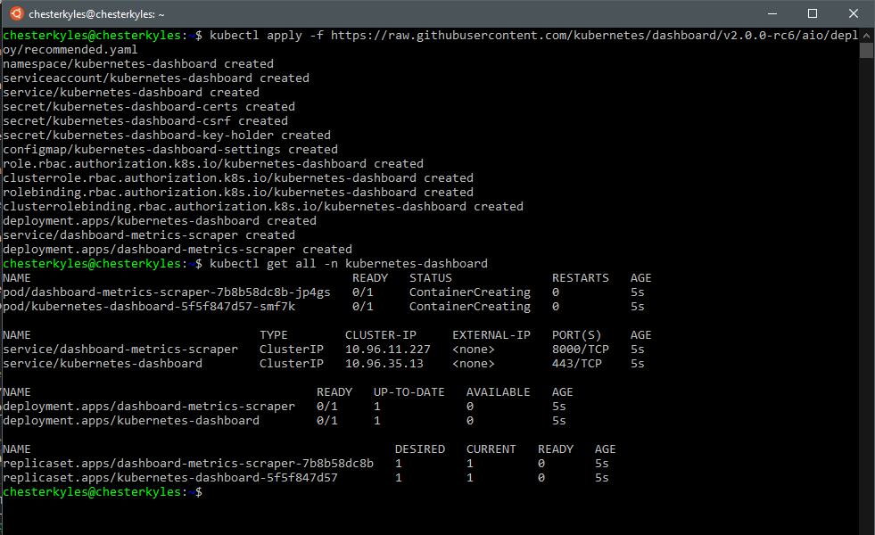
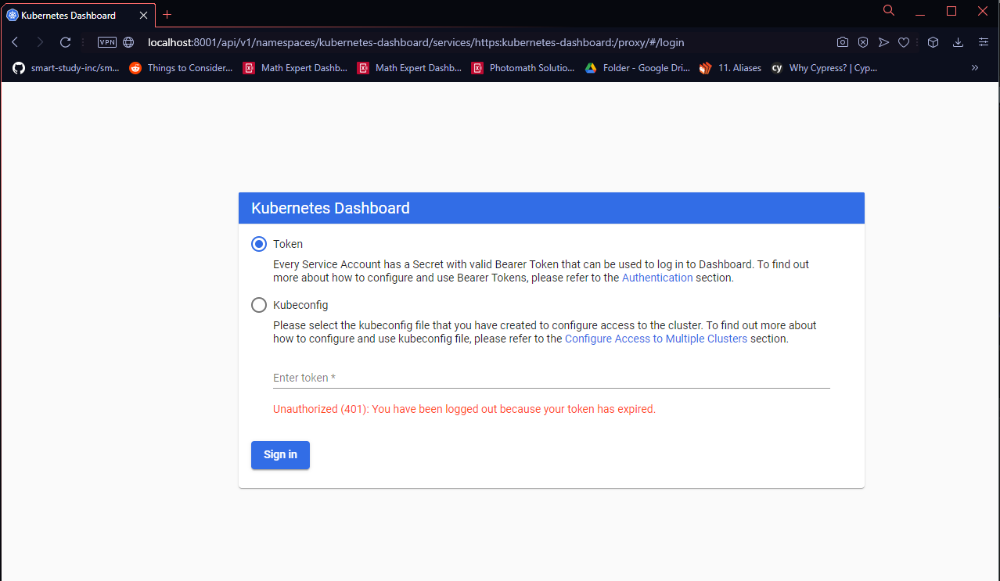
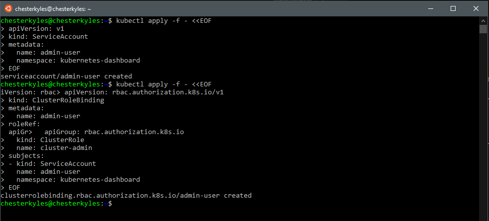
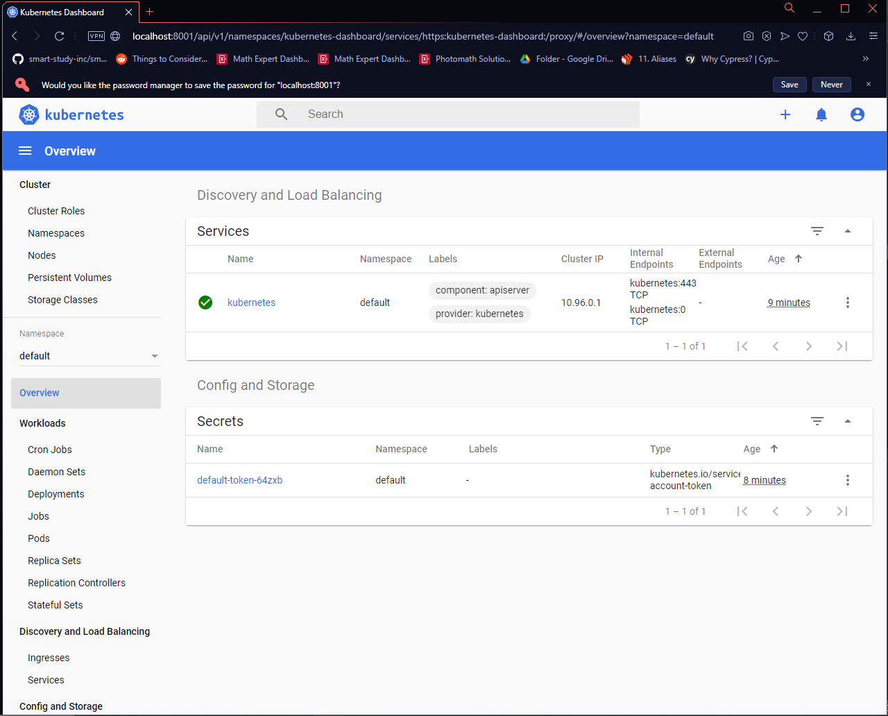

# Setup Kubernetes with WSL and Docker

## Why Kubernetes on Windows

For the last few years, Kubernetes became a de-facto standard platform for running containerized services and applications in distributed environments. While a wide variety of distributions and installers exist to deploy Kubernetes in the cloud environments (public, private or hybrid), or within the bare metal environments, there is still a need to deploy and run Kubernetes locally, for example, on the developer's workstation.

Kubernetes has been originally designed to be deployed and used in the Linux environments. However, a good number of users (and not only application developers) use Windows OS as their daily driver. When Microsoft revealed WSL - the Windows Subsystem for Linux, the line between Windows and Linux environments became even less visible.

Also, WSL brought an ability to run Kubernetes on Windows almost seamlessly!

## Prerequisites

Here is the list of the prerequisites needed and their version/lane:

- **OS**: Windows 10 version 2004, Build 19041
- WSL2 enabled
  - In order to install the distros as WSL2 by default, once WSL2 installed, run the command `wsl.exe --set-default-version 2` in Powershell
- WSL2 distro installed from the Windows Store
- Docker Desktop for Windows, stable channel

## Enable WSL2 integration

```sh
chesterkyles@chesterkyles:~$ docker version
Client: Docker Engine - Community
 Cloud integration: 1.0.17
 Version:           20.10.8
 API version:       1.41
 Go version:        go1.16.6
 Git commit:        3967b7d
 Built:             Fri Jul 30 19:54:02 2021
 OS/Arch:           linux/amd64
 Context:           default
 Experimental:      true

Server: Docker Engine - Community
 Engine:
  Version:          20.10.8
  API version:      1.41 (minimum version 1.12)
  Go version:       go1.16.6
  Git commit:       75249d8
  Built:            Fri Jul 30 19:52:10 2021
  OS/Arch:          linux/amd64
  Experimental:     false
 containerd:
  Version:          1.4.9
  GitCommit:        e25210fe30a0a703442421b0f60afac609f950a3
 runc:
  Version:          1.0.1
  GitCommit:        v1.0.1-0-g4144b63
 docker-init:
  Version:          0.19.0
  GitCommit:        de40ad0
chesterkyles@chesterkyles:~$ kubectl version -o yaml
clientVersion:
  buildDate: "2021-07-15T21:04:39Z"
  compiler: gc
  gitCommit: ca643a4d1f7bfe34773c74f79527be4afd95bf39
  gitTreeState: clean
  gitVersion: v1.21.3
  goVersion: go1.16.6
  major: "1"
  minor: "21"
  platform: linux/amd64

The connection to the server localhost:8080 was refused - did you specify the right host or port?
chesterkyles@chesterkyles:~$
```

Note that the output of `kubectl` command, it found the **Client version** but didn't find any server. This is normal as we didn't enabe the Docker Kubernetes cluster.

## KinD: Kubernetes made easy in a container

```sh
# Check if the KUBECONFIG is not set
echo $KUBECONFIG

# Check if the .kube directory is created > if not, no need to create it
ls $HOME/.kube

# Create the cluster and give it a name (optional)
kind create cluster --name wslkind

# Check if the .kube has been created and populated with files
ls $HOME/.kube
```

<p align="center"></p>

The cluster has been successfully created, and because we are using Docker Desktop, the network is all set for us to use "as is".

So we can open the Kubernetes master URL in our Windows browser:

<p align="center"></p>

### Kubernetes Dashboard

Working on the command line is always good and very insightful. However, when dealing with Kubernetes we might want, at some point, to have a visual overview.

For that, the [Kubernetes Dashboard](https://github.com/kubernetes/dashboard) project has been created. The installation and first connection test is quite fast, so let's do it:

```sh
# Install the Dashboard application into our cluster
kubectl apply -f https://raw.githubusercontent.com/kubernetes/dashboard/v2.0.0-rc6/aio/deploy/recommended.yaml

# Check the resources it created based on the new namespace created
kubectl get all -n kubernetes-dashboard
```

<p align="center"></p>

```sh
# Start a kubectl proxy
kubectl proxy

# Enter the URL on your browser: 
# http://localhost:8001/api/v1/namespaces/kubernetes-dashboard/services/https:kubernetes-dashboard:/proxy/
```

<p align="center"></p>

Finally to login, we can either enter a Token, which we didn't create, or enter the `kubeconfig` file from our Cluster.

If we try to login with the `kubeconfig`, we will get the error "Internal error (500): Not enough data to create auth info structure". This is due to the lack of credentials in the `kubeconfig` file.

So to avoid you ending with the same error, let's follow the recommended [RBAC approach](https://github.com/kubernetes/dashboard/blob/master/docs/user/access-control/creating-sample-user.md).

```sh
# Create a new ServiceAccount
kubectl apply -f - <<EOF
apiVersion: v1
kind: ServiceAccount
metadata:
  name: admin-user
  namespace: kubernetes-dashboard
EOF
# Create a ClusterRoleBinding for the ServiceAccount
kubectl apply -f - <<EOF
apiVersion: rbac.authorization.k8s.io/v1
kind: ClusterRoleBinding
metadata:
  name: admin-user
roleRef:
  apiGroup: rbac.authorization.k8s.io
  kind: ClusterRole
  name: cluster-admin
subjects:
- kind: ServiceAccount
  name: admin-user
  namespace: kubernetes-dashboard
EOF
```

<p align="center"></p>

```sh
# Get the Token for the ServiceAccount
kubectl -n kubernetes-dashboard describe secret $(kubectl -n kubernetes-dashboard get secret | grep admin-user | awk '{print $1}')
# Copy the token and copy it into the Dashboard login and press "Sign in"
```

<p align="center"></p>

## Minikube: Kubernetes from everywhere

Read here: <https://kubernetes.io/blog/2020/05/21/wsl-docker-kubernetes-on-the-windows-desktop/#minikube-kubernetes-from-everywhere>
